## 개발 기간

- 2024-05-16 ~ 2024-05-23

## 팀 구성

|  팀원  |   역할   |
| :----: | :------: |
| 이용성 | Frontend |
| 정석영 | Backend  |
| 최용훈 | Backend  |

## 개발 환경 및 기술 스택

### Backend

- Java
- Spring Boot

### Frontend

- Vue
- CSS

### Data

- MySQL
- AWS RDS
- MyBatis

## ERD

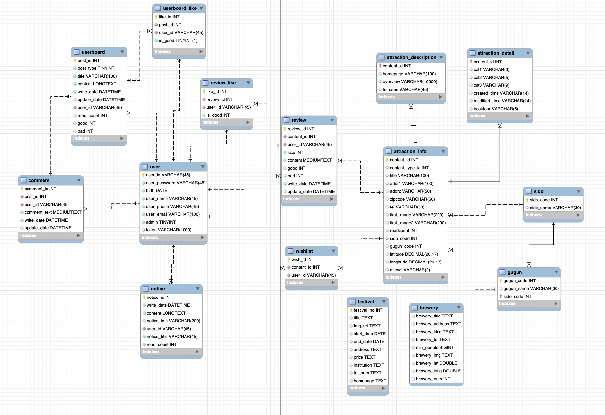

## UML

### class Diagram

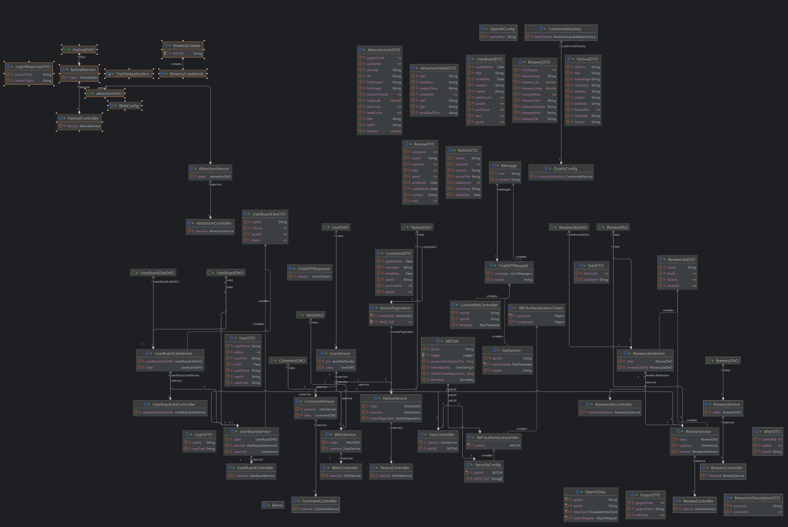

### Usecase Diagram

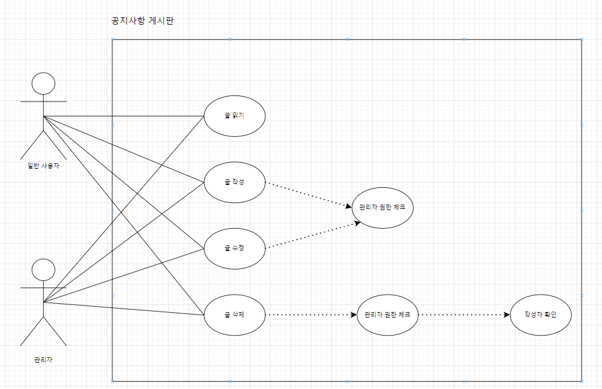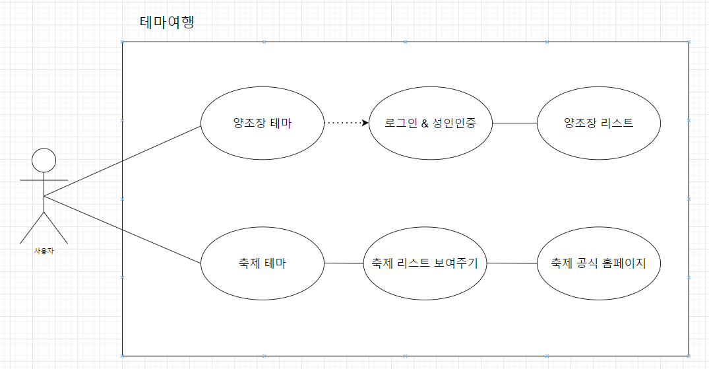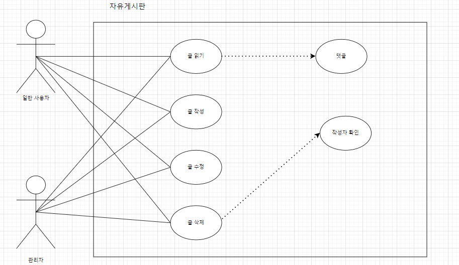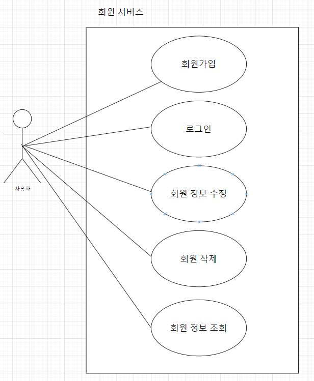

## 데이터 준비

전통주 양조장 데이터와 한국 축제 정보를 Selenium을 통해 동적 크롤링

양조장 데이터: https://www.goingsool.com/

축제 정보: https://korean.visitkorea.or.kr/search/search_list.do?keyword=%EC%B6%95%EC%A0%9C

## 서비스 기능

### 1. 홈 화면

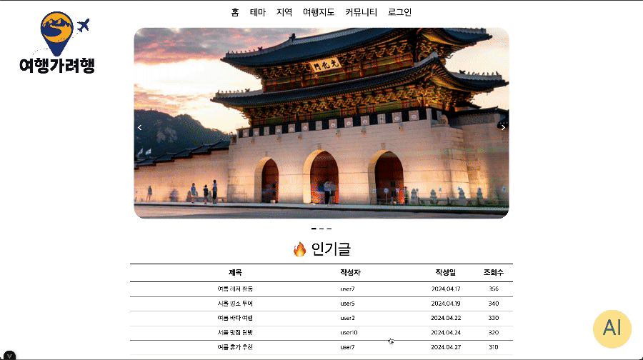

- 인기글 및 여행지 사진을 Vue Slide로 표시
- 홈 화면에 있는 인기글 클릭시 해당 글 상세보기로 이동

### 2. 테마

#### 2-1. 양조장 테마

- 19세 미만 사용자 및 로그인 안 한 사용자 접근시 경고 화면
- 양조장 리스트 제공

#### 2-2. 축제 테마

- 무한 스크롤을 통한 축제 조회
- 축제 기간 순으로 정렬
- 축제를 클릭하면 해당 축제의 홈페이지로 이동

### 3. 지역 여행 페이지

- 지역별 관광지 선택 및 추천 관광지 조회
- 지역별 랜덤 관광지 3개, 지역별 랜덤 식당 3개 제공
- 지역 문화 관광 홈페이지로 바로가기
- 관광지 정보 자세히 보기 기능

### 4. 지도 페이지

- 위치 조회 및 위치 기준 인근 정보 조회
- 마커별 아이콘 다름
- 지도 화면이 움직일 때마다 새로운 위치 기준으로 마커 표시
- 마커를 클릭하면 상세보기 열림
- 상세보기 리스트는 해당 관광지 주변 여행지로 구성
- 더 상세보기 및 리뷰 남기기 가능

### 5. 커뮤니티

#### 5-1. 공지사항

- 관리자만 글 쓰기, 글 수정, 글 삭제 가능
- 모든 사용자 글 보기 가능

#### 5-2. 자유게시판

- 로그인 된 사용지만 게시글 쓰기 가능
  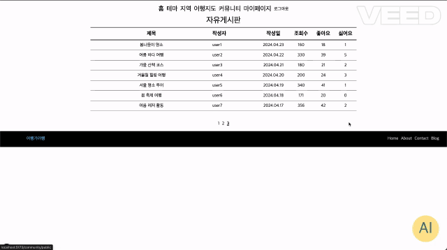
- 자신이 쓴 글 만 수정, 삭제 가능
- 댓글 기능 제공
- 본인의 글일 경우에만 글 관리 버튼 활성화

### 마이페이지

- 회원 정보 조회 및 삭제 가능

### 회원

#### 로그인

- 아이디 비밀번호 입력받아 로그인
- (아이디 비밀번호 입력받아 토큰화 구현예정)

#### 로그아웃

- 로그아웃
- (jwt토큰 유효성 제거로 로그아웃 구현예정)

#### 회원가입

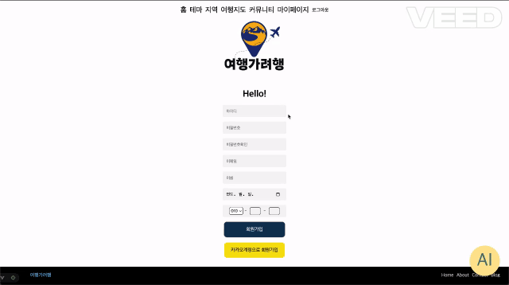

- 실시간 ID 중복체크
- 실시간 비밀번호 체크

#### 아이디 찾기

- 유저 정보로 아이디 리턴

#### 비밀번호 찾기

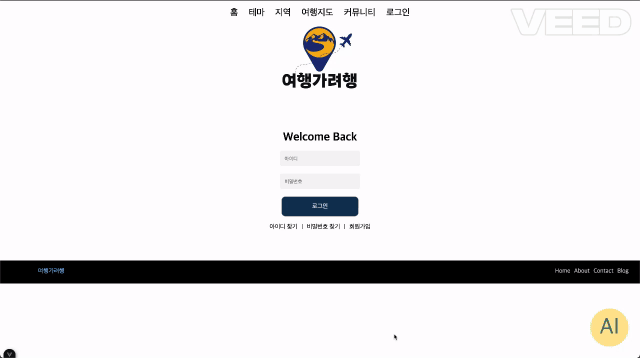

- 이메일로 임시 비밀번호 전송

### 챗봇

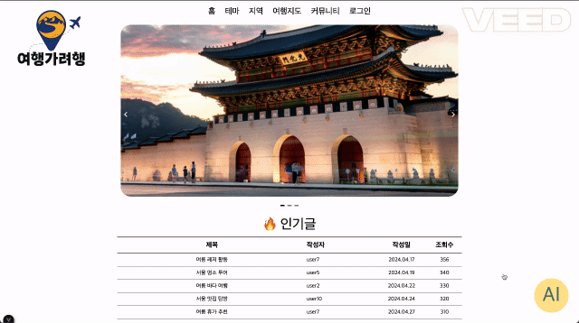

- OpenAI API를 이용한 챗봇 기능

### 리뷰

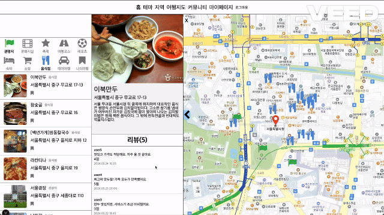

- 로그인된 사용자만 댓글 작성 가능
